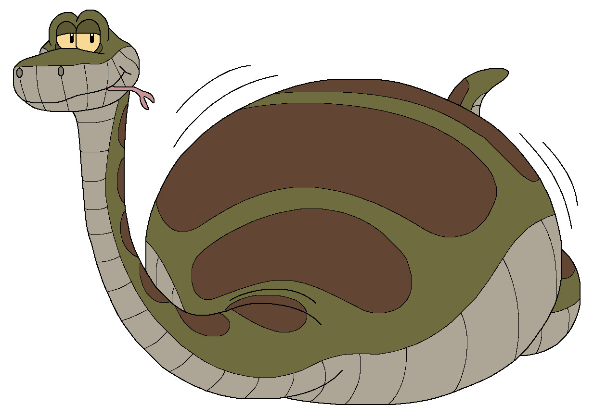

# Python+



Bij Python+ ga je aan de slag aan een groter Python-project. Groter dan dat je bij Basis van Programmeren met Python hebt gedaan. Wat je gaat maken, dat mag je helemaal zelf verzinnen. We gaan in deze module vooral kijken naar:

- Hoe je een groter programma schrijft en waar je tegenaan loopt
- Het gebruik van professionele gereedschappen (PyCharm en Git)
- Hoe zorg je dat je code er professioneel uitziet

Als je aan deze module begint, gaan we ervan uit dat je *de module Basis van Programmeren in Python* hebt afgerond. We verwachten dat je bekend met variabelen, `print`-statements, `if`- en `else`- statements , `for`- en `while`-loops en het definiëren van functies met `def`. Het is niet erg als dat een beetje is weggezakt. Kijk dan even in de syllabus van Basis van Programmeren in Python en maak wat oefeningen om je kennis wat op te frissen. We hebben echter geen tijd om hier uitgebreid mee te oefenen, dus zorg dat je deze basiskennis van Python paraat hebt.

Deze module sluit je af door het maken van een eindopdracht. Deze eindopdracht is een groter project, door jou geschreven in Python. Hoe de eindopdracht beoordeeld wordt en waar je op moet letten, kun je [hier](eindopdracht.md) vinden. Om je een beetje op weg te helpen, krijg je tijdens de lessen hulpmiddelen om een groter programma in Python te schrijven.

De **deadlines** voor deze module zijn:

- Inleveren van de eindopdracht: {{ deadline }}
- Aanvragen van uitstel: {{ deadline_uitstel_aanvragen }}
  - Uitgestelde deadline: {{ deadline_uitstel }}

Deze syllabus is opgedeeld in zeven weken, want er zitten zeven lesweken in een module. Per week staat er beschreven wat de onderwerpen voor de les van die week zijn.

Inhoudsopgave:

```{tableofcontents}
```
